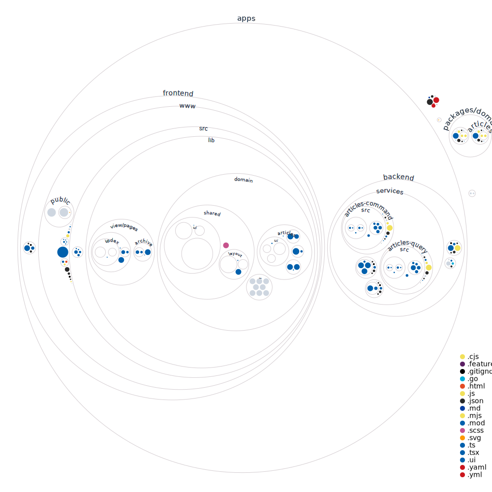

# Prensa! Prensa!



## Requirements

-  node: `16.13.0`
-  golang: `+1.17`
-  nvm
-  pnpm
-  docker

## Installation and development

```bash
pnpm install

# install first workspace package deps
pnpm packages:build
```

### frontend-www

```bash
# create `.env.local` on apps/frontend/www/.env.local
touch apps/frontend/www/.env.local

# write env
echo "NEXT_PUBLIC_API_URL='http://localhost:4000'" >> apps/frontend/www/.env.local

# start mocked frontend
pnpm frontend-www:dev
```

### backend-services-articles-query

```bash
# start mocked backend on :4001
pnpm backend-services-articles-query:dev
```

### backend-services-articles-command

```bash
# start mocked backend on :4002
pnpm backend-services-articles-command:dev
```

## Deployment

```bash
docker-compose build
```

```bash
docker-compose up
```

### Navigator

Recommended: `chrome >95`
