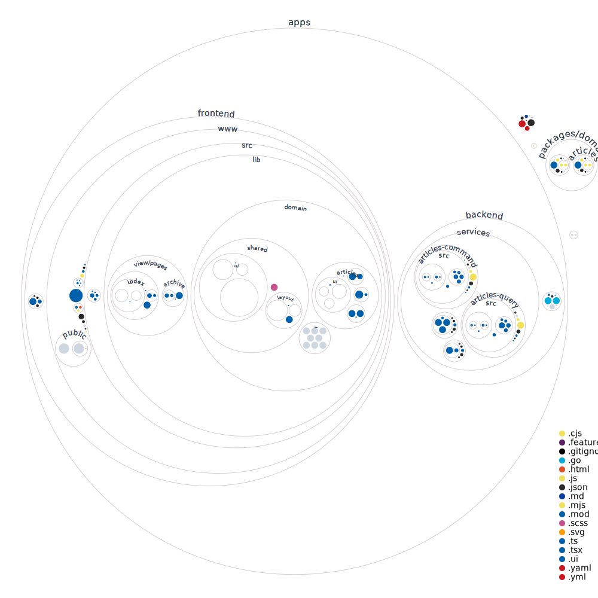

# Prensa! Prensa!



## Requirements

-  node: `16.13.0`
-  golang: `+1.17`
-  nvm
-  pnpm

## Installation

```bash
pnpm install
```

## frontend-www

```bash
pnpm frontend-www:lint
pnpm frontend-www:test
pnpm frontend-www:dev
pnpm frontend-www:build
pnpm frontend-www:storybook
```

## frontend-www-e2e

```bash
pnpm frontend-www-e2e:lint
pnpm frontend-www-e2e:start
pnpm frontend-www-e2e:report
```

## backend-gateway-e2e

```bash
pnpm backend-gateway-e2e:lint
pnpm backend-gateway-e2e:start
pnpm backend-gateway-e2e:report
```

## backend-services-articles-command-e2e

```bash
pnpm backend-services-articles-command-e2e:lint
pnpm backend-services-articles-command-e2e:start
pnpm backend-services-articles-command-e2e:report
```

## backend-services-articles-query-e2e

```bash
pnpm backend-services-articles-query-e2e:lint
pnpm backend-services-articles-query-e2e:start
pnpm backend-services-articles-query-e2e:report
```
